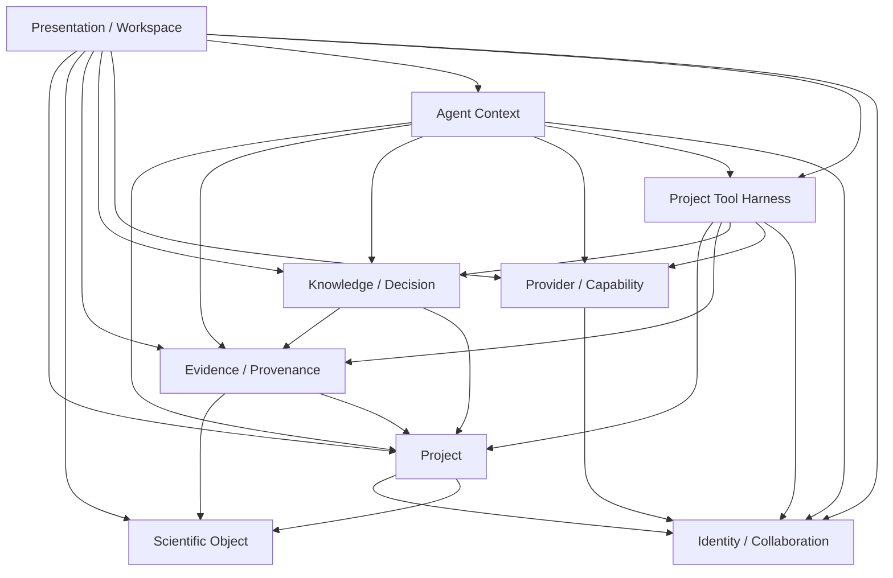

# Domain Boundaries

> **Status: Accepted** (merged into `main`). Defines each
> architectural domain — purpose, owned
> concepts, owned mutable state, invariants, public contracts, dependencies, and
> explicit non-responsibilities — plus the Project boundary decision.

The governing question for every decision in this document:

> **Who owns this knowledge, and what is the smallest durable boundary that keeps
> that ownership true?**

---

## Product boundary (recap)

```text
REvoLab       → scientific context / project knowledge layer
REvoCompute   → scientific execution layer
REvoDesign    → an unrelated existing interactive-design product (not a REvoLab backend)
External providers → biological databases, literature, models, instruments, services
```

**Canonical invariant:** REvoLab owns scientific context and relationships.
External systems own their capabilities and execution truth.

---

## The nine domains

### 1. Project Domain

- **Purpose:** the durable workspace boundary that scopes context, membership, and
  access.
- **Owned concepts:** Project record, project-level annotation, project visibility
  (`private` / `shared_with_members`), and **`ProjectResourceLink`** — the Project-owned
  context link that binds global resources into this Project's context (the visibility
  lens, see ADR-0008) **and carries the project-local folder/container placement** of
  those resources. Project **participation is expressed through the
  Identity/Collaboration membership contract** (see below) — Project does **not** own
  `ProjectMembership`.
- **Owned mutable state:** project name/description, visibility, and the Project's
  `ProjectResourceLink` set (the context links, including their folder/container
  placement, that a Project includes).
- **Owned invariants:**
  - A Project is a namespace *and* a security/permission boundary, but **not** the
    scientific-identity boundary.
  - Project deletion removes **links and membership**, never the underlying global
    scientific objects or their provenance; any `ResourceStewardship` this Project
    holds is **transferred or frozen** (owned by Identity), never cascaded.
  - Organization (folders) is not scientific semantics.
- **Public contracts:** project CRUD, project-scoped read and write entry points.
- **Dependencies:** Identity/Collaboration (membership, roles), Scientific Object
  (to *address* which global resources the Project's `ProjectResourceLink` set binds;
  the `ProjectResourceLink` rows themselves are **owned by Project** and FK
  `resource_id → global_resource_registry.resource_id`). Depends on nothing else in
  Core.
- **Non-responsibilities:** owning object lifecycle; owning execution; owning
  provider credentials; being the provenance authority.

### 2. Scientific Object Domain

- **Purpose:** represent typed scientific entities (Protein, Sequence, Structure,
  Variant, …) and their per-type metadata.
- **Owned concepts:** ScientificObject (universal spine), per-type extension
  records, ExternalIdentity registry (+ series↔external-identity mapping), Alias
  registry, the type registry, object versioning.
- **Owned mutable state:** object labels/descriptions (governance spine), aliases,
  per-type content (versioned, immutable once referenced). **Organization placement is
  NOT owned here** — it is project-local, owned by the Project domain.
- **Owned invariants:**
  - Universal fields are a small fixed spine; scientific payload lives in typed
    extension records, not an unvalidated JSON blob. **No `organization_anchor` /
    folder column on the global object.**
  - A referenced object's scientific content is immutable; change is a new
    version or a new object, never in-place.
  - Project-local organization (folders/placement) is separate from global
    scientific relations; a global object may be filed differently in each Project.
  - Durable identity is the stable UUID, never a path or a username.
  - **Mutation requires stewardship:** append revision, rename, add external identity,
    archive — all require an Identity-owned `ResourceStewardship` grant over the
    object; a `ProjectResourceLink` alone is read-only visibility.
- **Public contracts:** object create/read/version operations via the domain service;
  mutation commands accept an already-validated `MutationGrant` (a Core shared authority
  primitive issued by Identity at the command boundary).
- **Dependencies:** none in Core — Scientific Object is a **global leaf**; it is
  bound into Project contexts through `ProjectResourceLink` (owned by the consuming
  Project domain) and mutated only under an injected `MutationGrant`. It imports neither
  Project nor Identity.
- **Non-responsibilities:** expressing scientific relationships (that is the
  graph domain's job); owning external execution state.

### 3. Evidence / Provenance Domain

- **Purpose:** record what external work and internal observation underpin the
  project, and reconstruct *why things exist*.
- **Owned concepts:** RunReference, SessionReference, ArtifactReference,
  LiteratureReference, ExternalReference (an `external_identity_id` FK + resolver/cache
  metadata — it does **not** re-store `authority`/`native_id`; the Scientific Object
  domain owns the `ExternalIdentity` registry), Evidence (interpreted claim) and its
  source/target associations, the **global provenance edges #1–7**
  (`variant_of`, `derived_from`, `represents`, `evaluates`,
  `consumed_as_input_by`, `produced`, `imported_as`) as
  `GlobalProvenanceEdge`, and the **`ContentStore` byte boundary** for internal
  artifact bytes (`authority = revolab`; immutable, content-addressed, fsspec
  backend). (`generated_by` is a derived aggregation over
  `produced`+`imported_as`, never persisted; `supports`/`contradicts` are Evidence
  `polarity` fields, not edges — see `SCIENTIFIC_GRAPH.md`.)
- **Owned mutable state:** evidence interpretive fields (summary, confidence,
  scope); reference *status* (refreshable, resolved via the provider — never copied).
- **Owned invariants:**
  - Reference nodes are durable, immutable identity cards; a reference is a
    **fact**, Evidence is an **interpreted claim**.
  - Contradiction coexists; a Decision settles it.
  - Provenance must remain traversable after external systems change.
  - **Global edges have no generic writer:** `produced` is created by run import,
    `imported_as` by the import command, `consumed_as_input_by` by task submission,
    `variant_of`/`represents`/`derived_from`/`evaluates` by object commands — each with
    the **per-edge creator authority** from `SCIENTIFIC_GRAPH.md` (`steward(source)` for
    #1–4; task-submission / import / provider authority for #5–7), never a blanket
    stewardship of both endpoints.
  - **Project-context write-time invariant:** a project-scoped Evidence (or its
    source/target) may only reference global endpoints already visible through that
    Project's `ProjectResourceLink` set — never ghost knowledge (same write-time rule
    as the Knowledge domain's `ProjectKnowledgeEdge`).
- **Public contracts:** evidence/reference CRUD, typed global-edge creation commands
  (each accepts an already-validated `MutationGrant`), plus provenance traversal queries.
- **Dependencies:** Scientific Object, Project. (Global-edge and reference-importing
  commands are authorized by an injected `MutationGrant`; the domain itself imports
  neither Identity nor the grant issuer.)
- **Non-responsibilities:** storing external execution truth; versioning external
  artifacts; being a graph database.

### 4. Knowledge / Decision Domain

- **Purpose:** the knowledge layer — decisions and the promotion of proposals into
  accepted project truth.
- **Owned concepts:** Decision (with status and supersession), DecisionEvidence
  citations, "current conclusion" (derived by following supersession), and the
  **project knowledge edges #8–10** (`selects`, `supersedes`, `cites`) as
  `ProjectKnowledgeEdge`.
- **Owned mutable state:** decision status and next actions while open; after a
  decision influences later work it is immutable.
- **Owned invariants:**
  - Agent output is conversation until explicitly promoted into project knowledge.
  - A committed decision is never edited; it is superseded.
  - Project knowledge edges are immutable and are archived **with** their
    Decision/Evidence on Project tombstone — never kept as dangling global edges.
  - **Project-context write-time invariant:** `Decision.selects` may only target a
    Series/Revision already visible through that Project's `ProjectResourceLink` set,
    and every `ProjectKnowledgeEdge` endpoint must be similarly visible (same rule as
    Evidence source/target).
  - "Current scientific conclusion" is a derived query, not a mutable field.
- **Public contracts:** decision draft → commit → supersede; cite evidence.
- **Dependencies:** Evidence/Provenance, Project.
- **Non-responsibilities:** building a premature ELN ontology; owning the chat log.

### 5. Provider / Capability Domain

- **Purpose:** the boundary between Core and external execution / artifact
  resolution.
- **Owned concepts:** Provider, Driver, Capability, capability discovery, typed
  CapabilityError. **Not owned here:** `Tool` (the Project Tool Harness owns the
  first-class Tool abstraction + the closed Local Tool Runtime; the Agent and the
  workspace consume one ToolCatalog — see `PROJECT_TOOL_HARNESS.md`),
  `ExternalProviderCredentialBinding` (the Identity / Collaboration domain owns the
  non-secret binding), and secret material (the Credential/Secret store owns it; see
  `PROVIDER_CAPABILITIES.md`). A Driver is only an implementation detail behind a
  Tool that crosses an external boundary.
- **Owned mutable state:** in-process driver lifecycle (startup only), availability
  projections.
- **Owned invariants:**
  - Core knows a fixed vocabulary of capability *kinds*; credentials are owned by
    the credential store; a provider is callable iff its driver is READY, every
    required credential kind is present **for the calling Actor**, and project policy
    permits — all derived queries, never stored truth.
  - Provider-specific vocabulary lives in the driver, never in Core.
- **Public contracts:** capability Protocols, Provider Catalog, schema-as-data
  discovery (JSON Schema).
- **Dependencies:** Identity/Collaboration (credential presence). Depends on
  nothing else in Core.
- **Non-responsibilities:** owning project graph; storing external state.

### 6. Agent Context Domain

- **Purpose:** give the Agent a bounded, reference-based view of project truth and
  typed ways to act, without making it an owner.
- **Owned concepts:** ProjectContext (value object), ContextSelection,
  ContextBuilder (read-only), AgentSession (ephemeral), SkillCatalog. The Agent
  **consumes** the Project Tool Harness's ToolCatalog (Phase 7); it does not own it.
- **Owned mutable state:** none in the durable graph (sessions are ephemeral).
- **Owned invariants:** chat history is not project truth; context references large
  artifacts instead of embedding them; the agent never raw-writes.
- **Public contracts:** context assembly, typed tool calls (via the shared
  ToolCatalog), skill loading.
- **Dependencies:** Project, Evidence/Provenance, Knowledge/Decision, Project Tool
  Harness (for tools), Identity/Collaboration (authority). The Agent is a consumer
  of these.
- **Non-responsibilities:** owning the database; being the persistence layer; RAG.

### 7. Identity / Collaboration Domain

- **Purpose:** ownership, membership, and sharing boundaries (built for, but not
  executing, real authentication).
- **Owned concepts:** AuthenticationIdentity, Actor (opaque UUID), Role
  (owner/member/viewer), **ProjectMembership** (single owning domain),
  **ResourceStewardship** (the mutation-authority grant over a global resource —
  visibility is not stewardship), ResourceOwnership, ExternalProviderCredentialBinding.
- **Owned mutable state:** memberships, roles, stewardship grants, credential bindings.
- **Owned invariants:** durable identity is an opaque UUID, not a path or auth
  username; sharing never copies data into another project; access is inherited
  from project membership; **read visibility (`ProjectResourceLink`) never grants
  mutation** — only `ResourceStewardship` does.
- **Public contracts:** membership/role operations (Project consumes this contract);
  `ResourceStewardship` grant/transfer/freeze; and **`MutationGrant` issuance** — the
  command boundary calls Identity to authorize a mutation, and the grant (not the
  caller) is passed into the domain command. This is the ownership boundary for the
  domain and agent authority model.
- **Dependencies:** none in Core — this domain **owns ProjectMembership** and treats
  the Project only as an opaque UUID in the membership row, so it does **not** depend on
  the Project domain. (This breaks the former circular ownership: Project → Identity,
  never Identity → Project.)
- **Non-responsibilities:** a big RBAC engine; real authentication (deferred).

### 8. Presentation / Workspace Domain

- **Purpose:** the product surface and the API/frontend contract.
- **Owned concepts:** the resource/command API surface, object-detail aggregate,
  provider capability surface, workspace information architecture.
- **Owned mutable state:** the generated TypeScript client (build artifact).
- **Owned invariants:** the frontend consumes generated contracts; no manually
  duplicated enums.
- **Public contracts:** the HTTP API and its generated client.
- **Dependencies:** every Core/Presentation-facing domain surface, including the
  Project Tool Harness (`/tools`, `/tools/invocations`).
- **Non-responsibilities:** business logic; scientific semantics.

### 9. Project Tool Harness Domain

- **Purpose:** make **Tool a first-class Project Harness abstraction**: a typed,
  closed execution surface over Project resources that both the human workspace and
  the Agent use.
- **Owned concepts** (the single owner of Tool): canonical **Tool descriptor**
  (`ToolDescriptorRead`), **`ToolCatalog`** (the one projection for frontend +
  Agent), **`LocalToolRuntime`** (lookup → schema validation → authorization →
  registered handler → typed output), the fixed **local tool registry**, and the
  **`ToolInvocation`** reproducibility record. **Not owned here:** Drivers and
  Capabilities (Provider/Capability owns those), and the Agent loop (Agent Context
  owns that).
- **Owned mutable state:** `tool_invocations` (project-scoped activity/reproducibility
  record) and persisted derived-artifact rows created through the ContentStore →
  ArtifactReference path.
- **Owned invariants:** Tool schemas derive from canonical Pydantic models (never
  hand-copied); local execution is closed and bounded (no arbitrary
  Python/shell/filesystem/HTTP/SQL); a `ToolResult` is never auto-promoted to
  Evidence/Decision truth; remote REvoCompute Tools are projected, never re-implemented
  here.
- **Public contracts:** `build_tool_catalog`, `LocalToolRuntime.invoke`, and the
  `revolab/tools` package API consumed by Presentation and Agent Context.
- **Dependencies:** Project, Evidence/Provenance, Knowledge/Decision (typed domain
  commands via the shared application command boundary `revolab.services`),
  Provider/Capability (remote-tool projection via `catalog_entries`/`drivers`/
  `domain.compute`), and Identity/Collaboration (authority via membership).
- **Non-responsibilities:** owning Drivers/Capabilities/credentials; executing
  remote compute; being the Agent's context builder; owning project truth.

---

## Dependency diagram (single canonical acyclic DAG)

**Arrow meaning (single convention):** `A --> B` means **A imports/consumes B's
public contract** (a code/build dependency direction, not data flow). This is the
**same** DAG as `SYSTEM_ARCHITECTURE.md`; no other document draws a competing one.



`Scientific Object` and `Identity / Collaboration` are **global leaves** with no
outgoing edges (they depend on nothing in Core). The graph is acyclic: Core domains
never depend on the Agent or the Project Tool Harness, and no domain depends on a
downstream sibling in a cycle. `PJ --> IC` (Project consumes the Identity membership
contract) is one direction only — Identity owns membership and depends on nothing in
Core, so there is no cycle. `Tool` has exactly one owner (Project Tool Harness);
`Presentation` and `Agent Context` only consume its `ToolCatalog`.

---

## Project boundary decision

**Decision:** use **global/stable resource identity + project-scoped
reference/membership/annotation** — *not* "Project owns every object directly."

Rationale:
- Cross-user sharing is a stated requirement; a project-owns-everything model
  forces object duplication to share, which the brief forbids.
- Identity must be decoupled from filesystem paths and auth usernames.
- Project is simultaneously a namespace, a security boundary, and (weakly) a
  provenance scope — but each concern is reified separately so they can evolve
  independently.

Consequences:
- An object can belong to multiple projects via multiple membership/link rows, not
  duplication.
- A project can reference an object owned elsewhere (that *is* the sharing
  mechanism).
- Project does **not** own object lifecycle; deleting a Project removes links, not
  the underlying objects or their provenance.
- Provenance must remain traversable across projects and survive Project deletion.

This decision is recorded in **ADR-0008**.
