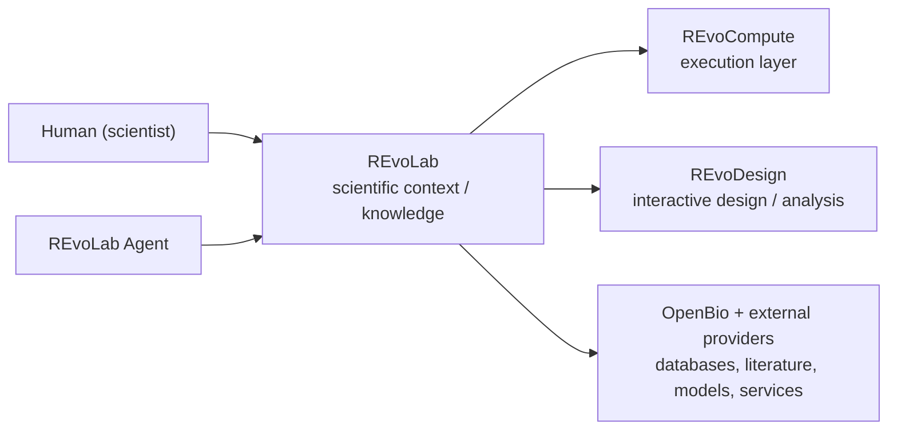
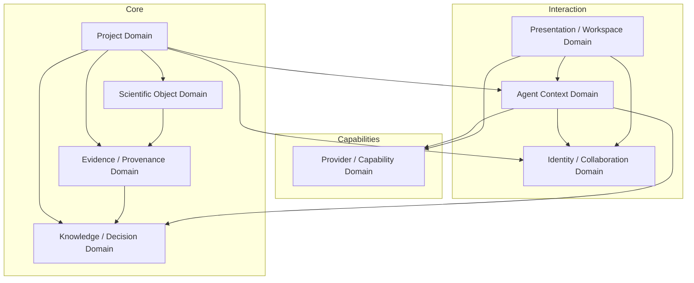
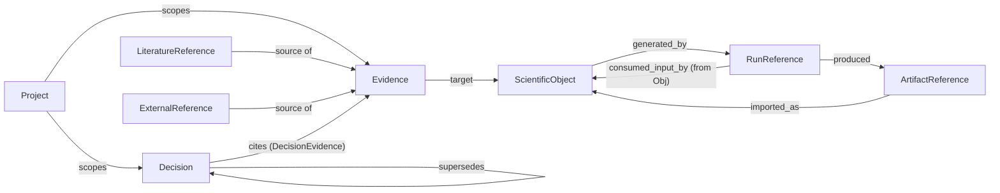
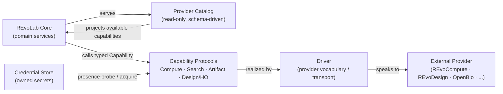
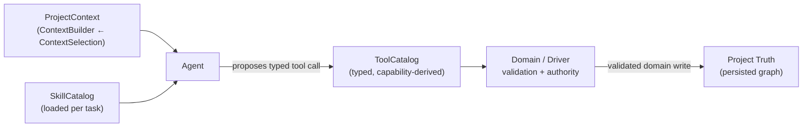
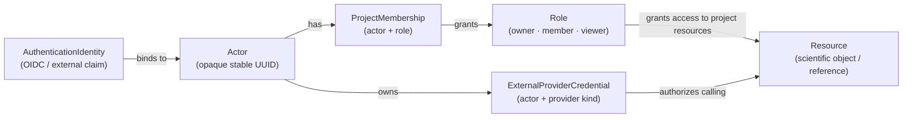

# REvoLab System Architecture

> **Status: Proposed — pending human architecture review.** Reconciled from eight
> parallel design analyses. Per the Harness authority model only a human (you) may
> accept or reject the top-level architecture; the `Accepted` status is set only
> after this PR is merged / you approve.
> This document is the top-level architecture of REvoLab. It answers *what are the
> stable architectural domains, what knowledge does each own, how they communicate,
> and where the extension boundaries are*. Lower-level questions each have their own
> document (see the Index).

## Product boundary (canonical, unchangeable)

```text
REvoLab
    scientific context / project knowledge layer

REvoCompute
    scientific execution layer

REvoDesign
    interactive molecular design / analysis layer

External providers
    biological databases, literature, models, instruments, services
```

### Canonical invariant

> **REvoLab owns scientific context and relationships. External systems own their
> capabilities and execution truth.**

REvoLab is the scientific project and context workspace. It answers: *what is
happening in a research project, what is known, which evidence supports a decision,
and what should happen next.* It is **not** an execution engine, **not** an
interactive design canvas, and **not** a mirror of any external database.

---

## System context



- REvoLab is the hub of *context*. All three external families are reachable only
  through REvoLab's Provider/Capability layer; neither the Human nor the Agent
  bypasses REvoLab to reach them for project work.
- REvoLab **records durable references** to external work; it **does not copy**
  external mutable execution state.

---

## Primary architectural domains

A **domain** is a stable cluster of owned concepts and obligations. Every concept
has exactly one owning domain; a domain depends on other domains only through
public contracts, never by reaching through to their internals.



The eight domains and their one-line purpose (detailed in
`DOMAIN_BOUNDARIES.md`):

| Domain | Owns |
|---|---|
| Project | the workspace boundary: project record, membership links, scoping |
| Scientific Object | typed scientific entities and their per-type metadata |
| Evidence / Provenance | references, evidence claims, and lineage edges |
| Knowledge / Decision | decisions and the promotion of proposals into project truth |
| Provider / Capability | providers, drivers, capabilities, credentials, tools |
| Agent Context | project-scoped context, tools, skills, and the agent loop |
| Identity / Collaboration | actors, authentication identities, membership, roles, credentials |
| Presentation / Workspace | API surface and the user workspace information architecture |

**Dependency discipline:** Core domains (Project, Scientific Object, Evidence,
Knowledge) never depend on the Agent Context domain. The Agent is a *consumer*,
not an owner, of project truth. Provider-vocabulary never leaks into Core.

---

## Internal dependency architecture

```text
Presentation / Workspace  (React, generated TS client)
        │
        ▼
Identity / Collaboration  (actor, membership, roles)
        │
        ▼
Agent Context  (ProjectContext, Tool/SkillCatalog) ──► Provider / Capability
        │                                                (credential-aware)
        ▼
Knowledge / Decision  ──► Evidence / Provenance ──► Scientific Object
        │                        │
        ▼                        ▼
    Project ─────────────────────┘   (project scopes all reads/writes)
        │
        ▼
    Relational persistence (PostgreSQL)
```

The dependency direction is strictly downward/leftward; there is **no circular
domain ownership**. Core domains are independent of the Agent and of any
particular provider.

---

## The knowledge graph (central to REvoLab)

REvoLab is, at its heart, a single logical directed graph over these node
categories (see `SCIENTIFIC_GRAPH.md` and `EVIDENCE_PROVENANCE.md`):



Directions derive from the single canonical edge matrix in `SCIENTIFIC_GRAPH.md`.
`supports`/`contradicts` are **fields** on Evidence (and `cited_as` on a Decision
`cites` join), not graph edges.

- **ScientificObject** is global context for one concrete scientific thing.
- **RunReference / SessionReference / ArtifactReference / LiteratureReference /
  ExternalReference** are *immutable identity cards* pointing at external work. They
  are **facts**, not claims.
- **Evidence** is the durable, interpreted *claim*: a source (a reference/experiment/
  note) + a target (an object/Decision) + polarity/scope. See `SCIENTIFIC_GRAPH.md`.
- **Decision** is the durable project conclusion that *cites* Evidence and can be
  superseded — never rewritten.

---

## Provider / capability architecture



Core knows only a fixed vocabulary of **capability kinds** (a Core-owned closed
enum) and consumes provider-specific schemas **as data**. Credentials are owned by
the Credential store; a provider is callable in a project iff its driver is **READY**
and every required credential kind is present — and both facts are **queries, never
stored truth**.

---

## Agent interaction



The loop is always:

```text
read context → reason → propose action → typed tool call
→ domain validation → persisted project truth
```

An Agent can **never** emit a raw write. Agent output is conversation until
explicitly promoted into project knowledge through a typed, domain-validated
operation.

---

## Identity / sharing



Authentication identity, Actor, membership, role, resource, and external
credential are **separate concepts**. Access is inherited from Project membership;
no per-object ACL and no RBAC engine in this phase.

---

## Document index

| Document | Answers |
|---|---|
| `SYSTEM_ARCHITECTURE.md` (this) | Domains, dependencies, and the whole-system view |
| `DOMAIN_BOUNDARIES.md` | Each domain: purpose, owned concepts, state, invariants, contracts, deps, non-responsibilities; Project boundary |
| `SCIENTIFIC_OBJECT_MODEL.md` | What a ScientificObject is; extension, version, lifecycle |
| `SCIENTIFIC_GRAPH.md` | Relation/edge semantics and the knowledge graph |
| `EVIDENCE_PROVENANCE.md` | Evidence, Run/Artifact/Literature references, Decision, promotion |
| `PROVIDER_CAPABILITIES.md` | Provider/Driver/Capability/Tool/Credential; REvoCompute/REvoDesign/OpenBio contracts |
| `AGENT_CONTEXT.md` | Context selection, tools, skills, safety/authority |
| `COLLABORATION_IDENTITY.md` | Identity, sharing, persistence, lifecycle/deletion, event/audit |
| `WORKSPACE_INFORMATION_ARCHITECTURE.md` | The product surface and API/frontend contract |
| `IMPLEMENTATION_ROADMAP.md` | Staged vertical slices and bootstrap classification |

Major irreversible decisions are recorded in `docs/architecture/adr/`.
