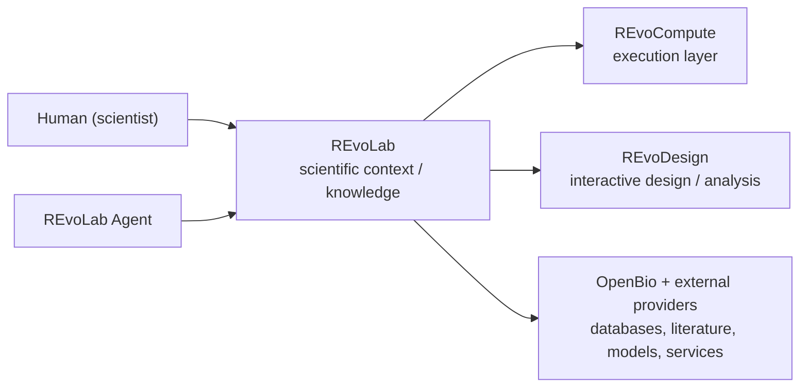
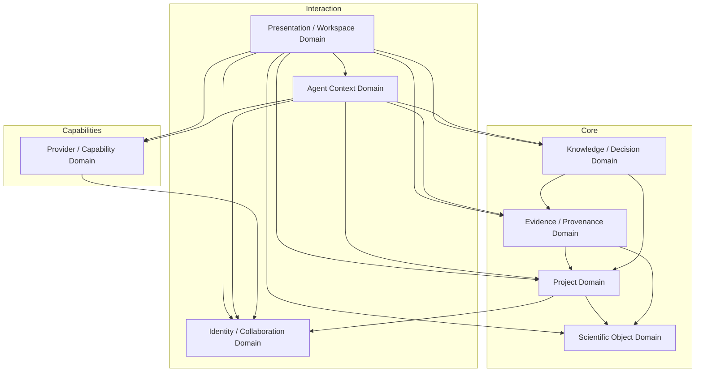
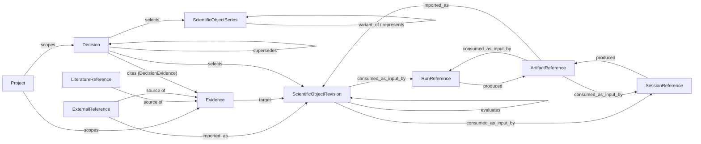
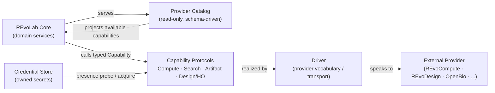
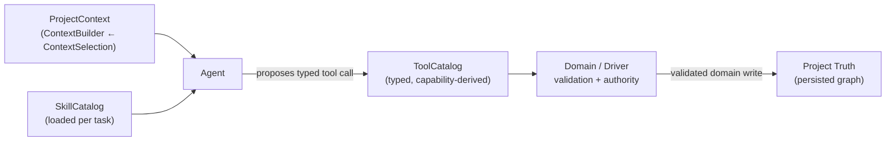
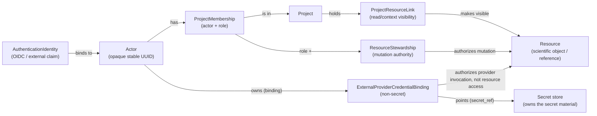

# REvoLab System Architecture

> **Status: Proposed — pending human architecture review.** Reconciled from eight
> parallel design analyses. Per the Harness authority model only a human (you) may
> accept or reject the top-level architecture; the `Accepted` status is set only
> after this PR is merged / you approve.
> This document is the top-level architecture of REvoLab. It answers *what are the
> stable architectural domains, what knowledge does each own, how they communicate,
> and where the extension boundaries are*. Lower-level questions each have their own
> document (see the Index).

## Product boundary (canonical, unchangeable)

```text
REvoLab
    scientific context / project knowledge layer

REvoCompute
    scientific execution layer

REvoDesign
    interactive molecular design / analysis layer

External providers
    biological databases, literature, models, instruments, services
```

### Canonical invariant

> **REvoLab owns scientific context and relationships. External systems own their
> capabilities and execution truth.**

REvoLab is the scientific project and context workspace. It answers: *what is
happening in a research project, what is known, which evidence supports a decision,
and what should happen next.* It is **not** an execution engine, **not** an
interactive design canvas, and **not** a mirror of any external database.

---

## System context



- REvoLab is the hub of *context*. All three external families are reachable only
  through REvoLab's Provider/Capability layer; neither the Human nor the Agent
  bypasses REvoLab to reach them for project work.
- REvoLab **records durable references** to external work; it **does not copy**
  external mutable execution state.

---

## Primary architectural domains

A **domain** is a stable cluster of owned concepts and obligations. Every concept
has exactly one owning domain; a domain depends on other domains only through
public contracts, never by reaching through to their internals.



**Arrow meaning (single convention):** `A --> B` means **A imports/consumes B's public
contract**. It is a code/build dependency direction, not a data-flow direction.
Global leaves `ScientificObject` and `Identity/Collaboration` have **no outgoing
edges** (they depend on nothing in Core); `Agent` and `Presentation` consume the
application-facing contracts of the domains below them. This graph is the **single**
authoritative dependency DAG — it is repeated verbatim in `DOMAIN_BOUNDARIES.md` and no
other document draws a competing one.

The eight domains and their one-line purpose (detailed in
`DOMAIN_BOUNDARIES.md`):

| Domain | Owns |
|---|---|
| Project | the workspace boundary: project record, project visibility/annotation, **owns `ProjectResourceLink`** (binds global resources into a Project context), scoping |
| Scientific Object | typed scientific entities and their per-type metadata (a global resource) |
| Evidence / Provenance | references, evidence claims, and lineage edges |
| Knowledge / Decision | decisions and the promotion of proposals into project truth |
| Provider / Capability | providers, drivers, capabilities, capability schemas |
| Agent Context | project-scoped context, tools, skills, and the agent loop |
| Identity / Collaboration | actors, authentication identities, membership, roles, credential **bindings** (`ExternalProviderCredentialBinding`: actor + provider + kind + `secret_ref`; the secret **material** lives in the Secret store) |
| Presentation / Workspace | API surface and the user workspace information architecture |

**Dependency discipline:** Core domains (Project, Scientific Object, Evidence,
Knowledge) never depend on the Agent Context domain. The Agent is a *consumer*,
not an owner, of project truth. Provider-vocabulary never leaks into Core.

---

## Internal dependency architecture

```text
Arrow meaning: A --> B  =  A imports/consumes B's public contract.

Relational persistence (PostgreSQL)

S Scientific Object          (global leaf; depends on nothing in Core)
I Identity / Collaboration   (global leaf; owns membership + credential **bindings** — material in the Secret store; Project owns ProjectResourceLink)

Project ------------------------------> Scientific Object   (links global resources)
Project ------------------------------> Identity            (membership contract)

Evidence / Provenance ----------------> Scientific Object   (references global objects)
Evidence / Provenance ----------------> Project             (project-scoped framing)

Knowledge / Decision -----------------> Evidence / Provenance
Knowledge / Decision -----------------> Project             (project-scoped decisions)

Provider / Capability -----------------> Identity           (credential contract: consumes the binding as an opaque handle; reaches material through the Secret store)

Agent Context ----> Project | Evidence | Knowledge | Provider | Identity   (consumer)
Presentation ----> Project | Scientific Object | Evidence | Knowledge |
                   Provider | Agent | Identity                              (all app-facing)
```

This is the **same single DAG** as the mermaid diagram above; `A --> B` always means
"imports/consumes B's public contract". The direction is acyclic: only `Scientific
Object` and `Identity / Collaboration` are global leaves, Core never depends on the
Agent, and no domain depends on a downstream sibling in a cycle.

---

## The knowledge graph (central to REvoLab)

REvoLab is, at its heart, a single logical directed graph over these node
categories (see `SCIENTIFIC_GRAPH.md` and `EVIDENCE_PROVENANCE.md`):



`RelationType` directions and endpoints derive from the single canonical edge matrix
in `SCIENTIFIC_GRAPH.md`; the diagram additionally shows the Project `scopes`
relationship and Evidence's own `source`/`target` associations, which are **not**
`RelationType` edges. **Conceptual semantic edges address Series; content/provenance
edges address Revision; a Decision targets a Series or a Revision explicitly.**
`generated_by` is deliberately **absent** — it is the derived two-edge traversal
`Revision ←imported_as← Artifact ←produced← Run/Session`, returned as an aggregate,
never persisted. `supports`/`contradicts` are **fields** on Evidence (and
`cited_as` on a Decision `cites` join), not graph edges.

- **ScientificObjectSeries** is the global conceptual identity of one scientific
  thing; **ScientificObjectRevision** is its immutable content version.
- **RunReference / SessionReference / ArtifactReference / LiteratureReference /
  ExternalReference** are *immutable identity cards* pointing at external work. They
  are **facts**, not claims.
- **Evidence** is the durable, interpreted *claim*: a source (a reference/experiment/
  note) + a target (a ScientificObjectRevision/Decision/Evidence) + polarity/scope.
  See `SCIENTIFIC_GRAPH.md`.
- **Decision** is the durable project conclusion that *cites* Evidence, *selects* a
  Series/Revision, and can be superseded — never rewritten.

(Evidence `source` may also be a Run/Session/ArtifactReference or a
ScientificObjectRevision; those edges are omitted from the diagram for brevity — the
frozen legal source/target sets live in `SCIENTIFIC_GRAPH.md`.)

---

## Provider / capability architecture



Core knows only a fixed vocabulary of **capability kinds** (a Core-owned closed
enum) and consumes provider-specific schemas **as data**. Credentials are owned by
the Credential store; a provider is callable in a project iff its driver is **READY**,
every required credential kind is present **for the calling Actor**, and project policy
permits — all derived **queries, never stored truth**.

---

## Agent interaction



The loop is always:

```text
read context → reason → propose action → typed tool call
→ domain validation → persisted project truth
```

An Agent can **never** emit a raw write. Agent output is conversation until
explicitly promoted into project knowledge through a typed, domain-validated
operation — where "promotion" means the `Decision draft → committed` transition
(ADR-0011), not ordinary object/evidence creation.

---

## Identity / sharing



Authentication identity, Actor, membership, role, resource, stewardship, and the
external credential **binding** are **separate concepts**. The binding is owned by the
Identity / Collaboration domain while the **secret material** it references is owned by
the Secret store. **Read access** flows `Actor → ProjectMembership → Project →
ProjectResourceLink → visible Resource`; **mutation** requires the membership role plus
`ResourceStewardship`; a credential binding authorizes a **provider invocation**, never
direct access to a Resource. No per-object ACL and no RBAC engine in this phase.

---

## Document index

| Document | Answers |
|---|---|
| `SYSTEM_ARCHITECTURE.md` (this) | Domains, dependencies, and the whole-system view |
| `DOMAIN_BOUNDARIES.md` | Each domain: purpose, owned concepts, state, invariants, contracts, deps, non-responsibilities; Project boundary |
| `SCIENTIFIC_OBJECT_MODEL.md` | What a ScientificObject is; extension, version, lifecycle |
| `SCIENTIFIC_GRAPH.md` | Relation/edge semantics and the knowledge graph |
| `EVIDENCE_PROVENANCE.md` | Evidence, Run/Artifact/Literature references, Decision, promotion |
| `PROVIDER_CAPABILITIES.md` | Provider/Driver/Capability/Tool/Credential; REvoCompute/REvoDesign/OpenBio contracts |
| `AGENT_CONTEXT.md` | Context selection, tools, skills, safety/authority |
| `COLLABORATION_IDENTITY.md` | Identity, sharing, persistence, lifecycle/deletion, event/audit |
| `WORKSPACE_INFORMATION_ARCHITECTURE.md` | The product surface and API/frontend contract |
| `IMPLEMENTATION_ROADMAP.md` | Staged vertical slices and bootstrap classification |

Major irreversible decisions are recorded in `docs/architecture/adr/`.
